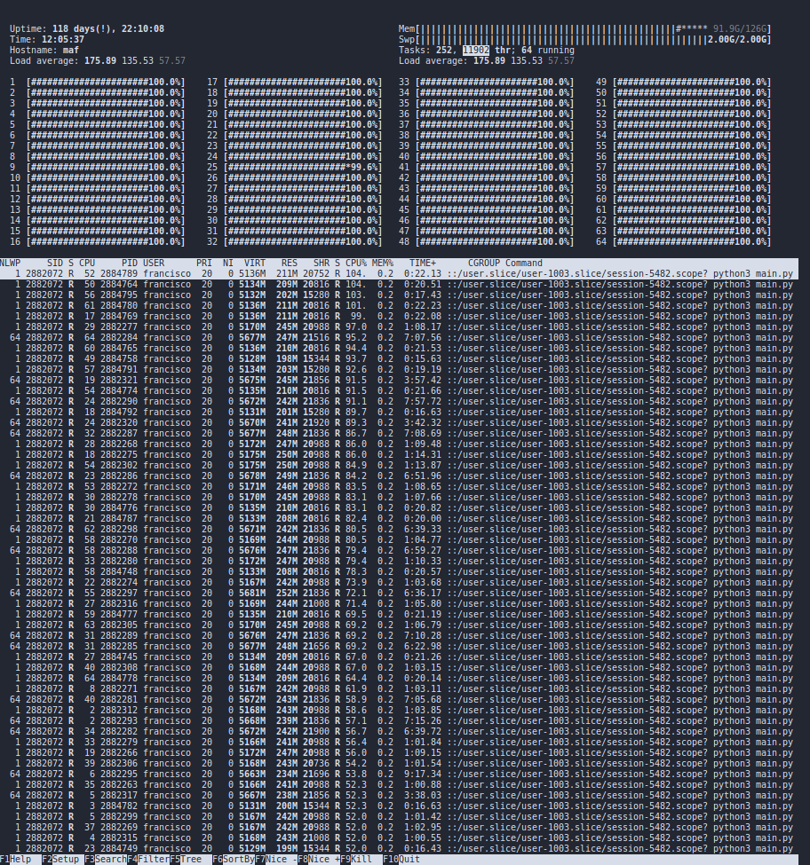
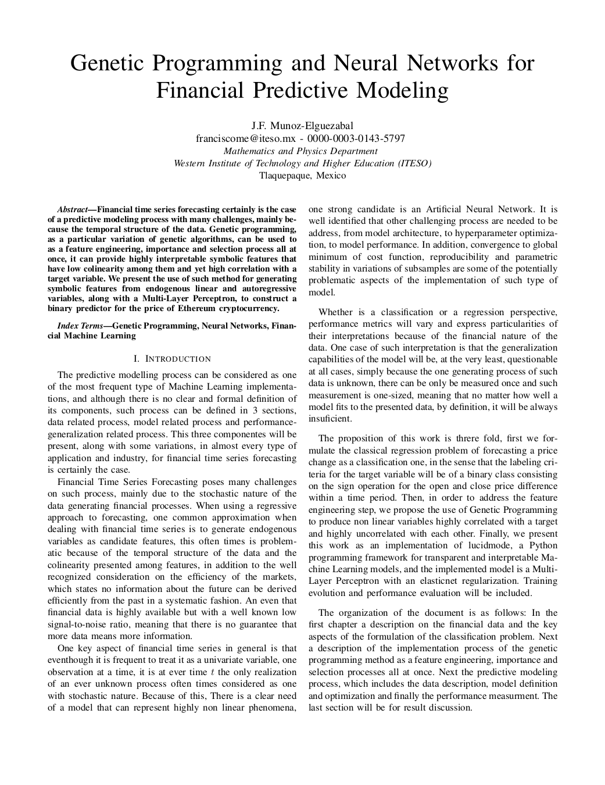
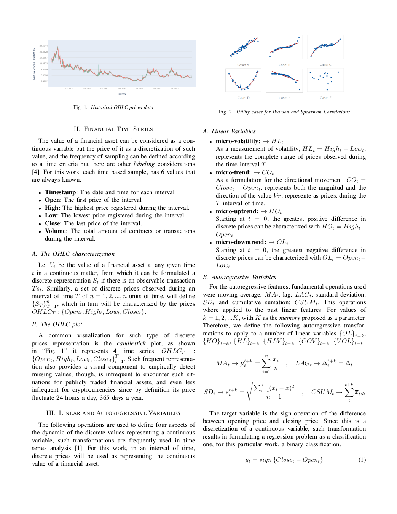
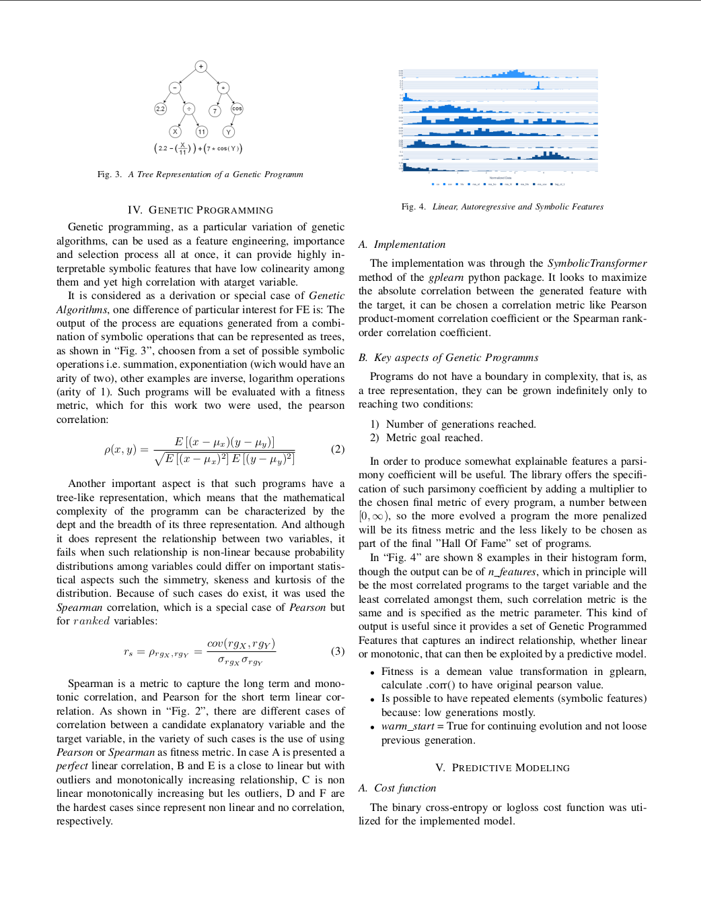
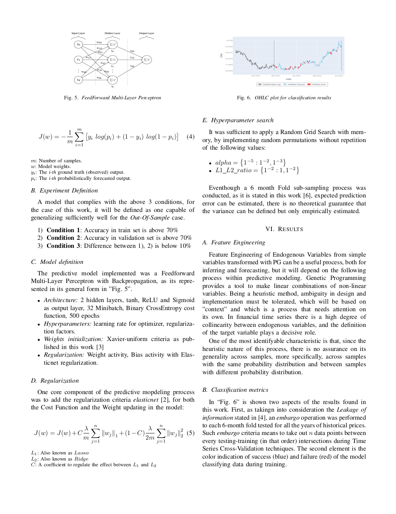

-------------------------------------------------------------------------
Genetic Programming and Neural Networks for Financial Predictive Modeling
-------------------------------------------------------------------------

**This is currently a private repository, it contains the whole project, data and execution codes to produce the results that will be used for the Master in Science in Data Science graduate programm. This is only made
public in order to apply to the** `Turing-LIDA DSG 2021`_

.. _`Turing-LIDA DSG 2021`:
   https://lida.leeds.ac.uk/partnerships/lida-partners/the-alan-turing-institute/turing-data-study-group-at-lida/call-for-researcher-participants/?_cldee=ZnJhbmNpc2NvbWVAaXRlc28ubXg%3d&recipientid=contact-7598eb94f040eb11a8130022483ed0bb-ec75aee3b0304fbca8aaab4ed46f6997&esid=1c8c41ef-eebe-eb11-bacc-000d3ad6a2e7\

--------
Abstract
--------

Financial time series forecasting certainly is the case of a predictive modeling process with many challenges, mainly because the temporal structure of the data. Genetic programming, as a particular variation of genetic algorithms, can be used to as a feature engineering, importance and selection process all at once, it can provide highly interpretable symbolic features that have low colinearity among them and yet high correlation with a target variable. We present the use of such method for generating symbolic features from endogenous linear and autoregressive variables, along with a Multi-Layer Perceptron, to construct a binary predictor for the price of Ethereum cryptocurrency.

--------------------
Main Functionalities
--------------------

- Autoregressive Feature Generation (**autoregressive_features**)
- Hadamard Product for Feature Generation (**hadamard_features**)
- Genetic Programming for Symbolic Operations for Feature Generation (**symbolic_features**)
- Timeseries Block Folds without filtration (**t_folds**)
- Classifier model: Logistic Regression with Elastic Net Regularization (**logistic_net**)
- Classifier model: L1 Support Vector Machines (**l1_svm**)
- Classifier model: Artificial Neural Net Multilayer Perceptron (**ann_mlp**)
- Genetic Algorithms Optimization (**genetic_algo_optimization**)
- Machine Learning Models Performance Metrics (**model_evaluation**)
- Plotly visualizations of results (**visualizations.py**)

------------------
Running on cluster
------------------

Because of the extensive explorations, this project was executed in a computing cluster at the ITESO university

|

|

Other progress is for the paper format in order to submit some of the findings to a journal ...

|

+---------+---------+
| |logo1| | |logo2| |
+---------+---------+
| |logo3| | |logo4| |
+---------+---------+

License
-------

Private. This content is intendedn only for the application to the `Turing-LIDA DSG 20212`_

.. _`Turing-LIDA DSG 20212`:
   https://lida.leeds.ac.uk/partnerships/lida-partners/the-alan-turing-institute/turing-data-study-group-at-lida/call-for-researcher-participants/?_cldee=ZnJhbmNpc2NvbWVAaXRlc28ubXg%3d&recipientid=contact-7598eb94f040eb11a8130022483ed0bb-ec75aee3b0304fbca8aaab4ed46f6997&esid=1c8c41ef-eebe-eb11-bacc-000d3ad6a2e7\
